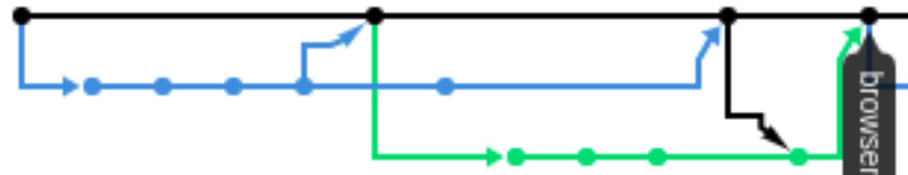
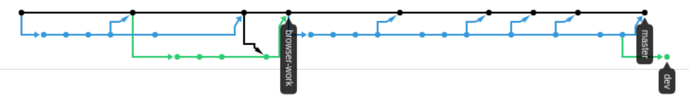

# class-branching
SCUG workshops on Git Branching

1. What sequence of changes & commits would produce the first image?  

1. How would you unite the branches near the end of the first image?

1. How would you update the 'browser-work' branch so it's caught up with the others in the second image?

1. What is the difference between merging and rebasing?

